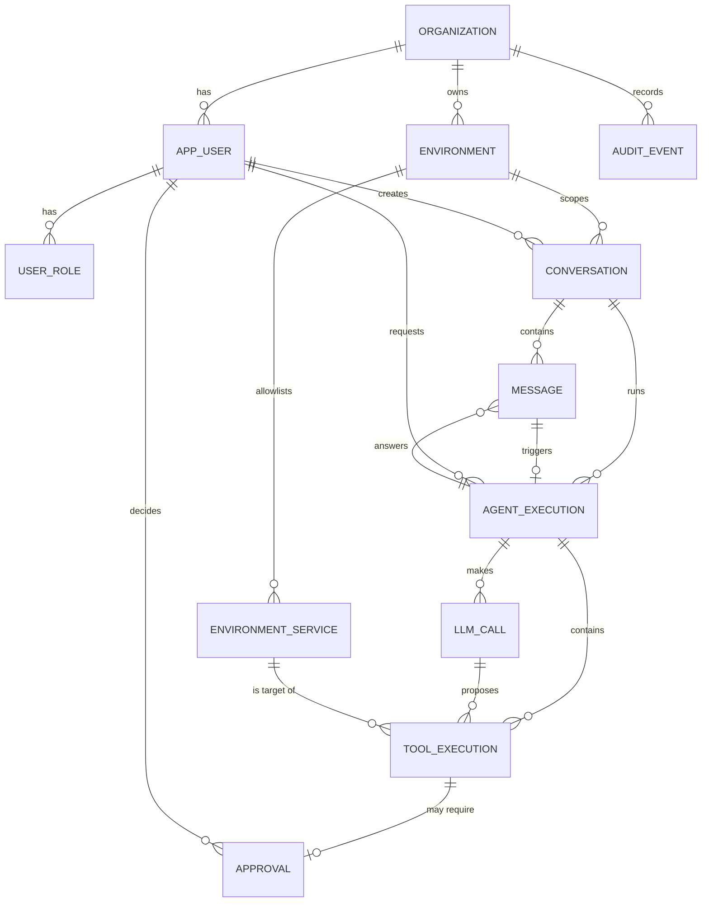

# 04 — Modelo de dados

> Status: **aceito** (2026-09-26), com três pontos a provar por teste de integração (seção 10). Nomes de tabelas e colunas em inglês, conforme o
> [CONTRIBUTING](../CONTRIBUTING.md). O DDL definitivo será escrito nas migrações Flyway durante a
> implementação. Este documento define **o que** existe e **por quê**.

## 1. Convenções globais

| Convenção | Decisão | Por quê |
|---|---|---|
| Chave primária | `id uuid`, de preferência **UUIDv7** (ordenado no tempo), gerado pela aplicação | IDs não enumeráveis na API (uma defesa extra, que **não** substitui a autorização), geráveis antes do insert e sem sequência central. O UUIDv7 mantém boa localidade no índice B-tree, ao contrário do UUIDv4 aleatório. **Decisão: o UUID nasce na aplicação**, e isso vale para todas as entidades de domínio. O domínio não depende de uma função do PostgreSQL para ter identidade. *O mecanismo exato de geração (suporte do Hibernate ou uma biblioteca) será escolhido e provado por teste.* |
| Tenant | Toda tabela, exceto `organization`, tem `organization_id uuid NOT NULL` | [ADR-005](adr/0005-organization-id-desde-o-mvp.md). **Sem exceções**: isso fica fácil de verificar por teste e prepara o Row-Level Security da V5. |
| Integridade entre tenants | As FKs entre tabelas de domínio são **compostas**: `(organization_id, parent_id) → parent(organization_id, id)` | O **banco** impede que uma `tool_execution` da organização A aponte para uma `agent_execution` da organização B, mesmo com um bug na aplicação. No JPA, o relacionamento continua mapeado pelo `id`, e a constraint composta existe só no SQL. |
| Datas | `timestamptz` em UTC (`Instant` no Java) | Sem ambiguidade de fuso horário. |
| Enums | `text` + `CHECK (col IN (...))`, `@Enumerated(STRING)` no JPA | Adicionar um valor é uma migração trivial. Os tipos `ENUM` nativos do PostgreSQL são mais rígidos de evoluir. |
| `jsonb` | **Só** para dados de formato variável: argumentos e saídas de ferramentas, detalhes de auditoria, snapshot de contexto | Nada que precise de filtro, junção ou regra de negócio fica em `jsonb`: isso continua sendo coluna normal. No Java, **não** haverá entidades cheias de `Map<String, Object>`. A entidade guarda o JSON, e a conversão para o *record* tipado de cada ferramenta acontece no executor (documento 05). |
| Concorrência | `version bigint` (lock otimista) nas entidades que mudam de estado concorrentemente | Base das transições condicionais da idempotência (arquitetura, seção 9). |
| Exclusão | Nenhuma exclusão física de entidades referenciadas pela auditoria. Usa-se `status = DISABLED`/`ARCHIVED`. As FKs são `ON DELETE RESTRICT`. | O histórico precisa continuar consistente. |
| Nomes | `snake_case`, tabelas no singular. `user` é palavra reservada no PostgreSQL, por isso a tabela chama `app_user`. | |

## 2. Das entidades sugeridas às tabelas

"Não criar tabelas desnecessárias" significa que cada entidade abaixo passou por uma pergunta: *existe
um dado ou comportamento que só uma tabela resolve?*

| Entidade sugerida | Decisão | Fase | Justificativa |
|---|---|---|---|
| Organization | `organization` | MVP (1 linha) | ADR-005. |
| User | `app_user` | MVP | |
| Permission | **Sem tabela.** Papéis em `user_role`; o mapeamento papel → permissões fica em código | MVP | O conjunto de permissões é pequeno e fixo, e muda junto com o código que as verifica. Uma tabela só se justifica com papéis customizáveis por organização, o que não está no roadmap. |
| Agent | **Sem tabela no MVP.** O modelo e a versão do prompt ficam registrados em cada `agent_execution` | V5 (se necessário) | No MVP existe um único agente, e uma tabela com uma linha e nenhum comportamento diferente seria prematura. Ela entra quando uma organização precisar de agentes com configurações distintas (ferramentas, orçamentos, prompts). |
| Environment | `environment` | MVP | |
| *(nova)* | `environment_service` | MVP | É a allowlist (RF-11), a peça central de segurança. |
| Tool | **Sem tabela.** O catálogo é código ([ADR-003](adr/0003-sem-shell-docker-via-proxy.md)); `tool_name` é gravado como texto | MVP | Uma tabela de ferramentas daria a falsa impressão de que ferramentas podem ser criadas por configuração. Na V5, uma tabela `tool_policy` pode **restringir** ferramentas por organização ou ambiente. |
| Conversation | `conversation` | MVP | |
| Message | `message` | MVP | Somente as mensagens do usuário e a resposta final do agente. O detalhe fica em `llm_call` e `tool_execution`. |
| AgentExecution | `agent_execution` | MVP | [ADR-009](adr/0009-historico-de-toolexecution-como-fonte-da-verdade.md). |
| *(nova)* | `llm_call` | MVP | Justificada a seguir (seção 4.8). |
| ToolExecution | `tool_execution` | MVP | ADR-009. |
| Approval | `approval` | MVP | [ADR-006](adr/0006-aprovacao-como-entidade.md). |
| AuditLog | `audit_event` | MVP | Append-only. Justificada na seção 4.11. |
| Incident | `incident` | V2 | Esboço na seção 7. |
| Deployment | `deployment` | V2 | Esboço na seção 7. |

**Resultado: 12 tabelas no MVP**, e cada uma responde a um requisito.

## 3. Diagrama entidade-relacionamento (MVP)



Visão em árvore (o mesmo modelo, agrupado por agregado):

```
organization
 ├── app_user ── user_role
 ├── environment
 │    └── environment_service                (allowlist)
 ├── conversation                           (vinculada a 1 environment)
 │    ├── message                            (USER | ASSISTANT)
 │    └── agent_execution                    (disparada por 1 message do usuário)
 │         ├── llm_call                      (cada ida e volta ao LLM)
 │         └── tool_execution                (cada proposta, inclusive as negadas)
 │              └── approval                 (0..1)
 └── audit_event                             (append-only, sem nenhuma FK)
```

## 4. Tabelas do MVP

Colunas comuns omitidas das tabelas abaixo: `id` (PK), `organization_id` (exceto em `organization`) e
`created_at`. `updated_at` e `version` aparecem só onde se aplicam.

### 4.1 `organization`

| Coluna | Tipo | Nulo | Notas |
|---|---|---|---|
| name | text | não | |
| slug | text | não | Único. Identificador legível. |
| status | text | não | `ACTIVE`, `SUSPENDED` |

No MVP há uma única linha, criada pelo seed. Na V5 recebe o plano e os limites de uso.

### 4.2 `app_user` e `user_role`

**`app_user`**

| Coluna | Tipo | Nulo | Notas |
|---|---|---|---|
| email | text | não | Único, sem diferenciar maiúsculas: índice único em `lower(email)` |
| display_name | text | não | |
| password_hash | text | não | BCrypt ou Argon2. **Nunca** serializado nem logado (RNF-SEG-07a). |
| status | text | não | `ACTIVE`, `DISABLED` |
| last_login_at | timestamptz | sim | |
| updated_at | timestamptz | não | |

**`user_role`**: PK `(user_id, role)`, com `role` em `VIEWER`, `OPERATOR`, `APPROVER` ou `ADMIN`. Os
papéis são **aditivos**: no MVP, o seu usuário tem todos.

**Decisão:** no MVP um usuário pertence a **exatamente uma** organização (`app_user.organization_id`). Se
na V5 for preciso que um usuário participe de várias, entra uma tabela `membership`. Essa decisão fica
para a V5, porque muda o modelo de autenticação (em qual organização estou agindo?).

**Papel → permissão (em código):**

| Permissão | VIEWER | OPERATOR | APPROVER | ADMIN |
|---|:-:|:-:|:-:|:-:|
| `EXECUTION_READ`: ver conversas e execuções | ✔ | ✔ | ✔ | ✔ |
| `AGENT_INTERACT`: conversar com o agente (ferramentas `READ_ONLY` em nome do usuário) | | ✔ | | ✔ |
| `TOOL_OPERATE`: o agente pode propor ferramentas `LOW_RISK`, `HIGH_RISK` e `DESTRUCTIVE` em nome do usuário, ainda sujeitas à política e à aprovação | | ✔ | | ✔ |
| `APPROVAL_DECIDE`: aprovar ou rejeitar | | | ✔ | ✔ |
| `AUDIT_READ` | | | ✔ | ✔ |
| `ENVIRONMENT_MANAGE`: ambientes, allowlist e nível de autonomia | | | | ✔ |

Cada ferramenta declara a **permissão** exigida. É isso que implementa a regra de que o agente nunca tem
mais poder que o usuário (arquitetura, seção 2.2).

**Regra arquitetural: papéis nunca são usados diretamente para autorizar.**

```
User → Role → PermissionResolver (matriz centralizada) → Permission → Policy Engine → Tool
```

- Ferramentas, controllers e serviços verificam **permissões** (`TOOL_OPERATE`), nunca **papéis**
  (`OPERATOR`). "OPERATOR" não significa "pode fazer qualquer operação"; significa o conjunto de
  permissões que a matriz atribui a ele.
- A matriz existe em **um único lugar** (`PermissionResolver`). Mudar o que um papel pode fazer é mudar
  uma linha, não procurar `if (role == …)` pelo código.
- Um teste de arquitetura garante que o enum `Role` só é referenciado pelo módulo `identity` e pelo
  `PermissionResolver`.

### 4.3 `environment`

| Coluna | Tipo | Nulo | Notas |
|---|---|---|---|
| name | text | não | Único por organização |
| description | text | sim | |
| type | text | não | `DOCKER` (outros tipos em fases futuras) |
| tier | text | não | `DEV`, `STAGING`, `PROD` |
| autonomy_level | text | não | `OBSERVE_ONLY`, `ASSISTED`, `AUTOMATED`. A aplicação rejeita `AUTOMATED` no MVP. |
| connection_ref | text | não | **Nome lógico** de uma conexão definida em configuração (por exemplo, `local` → `devops.runtime.connections.local.docker-url`, que aponta para o docker-socket-proxy). **Nunca** uma URL com credencial nem um segredo (RF-13). |
| status | text | não | `ACTIVE`, `DISABLED` |
| created_by | uuid | não | FK `app_user` |
| updated_at, version | | não | |

Mudar `autonomy_level` ou `status` gera um `audit_event`.

### 4.4 `environment_service` (allowlist)

No código, a entidade se chama `AllowlistedService`, para não confundir com um `@Service` do Spring.

| Coluna | Tipo | Nulo | Notas |
|---|---|---|---|
| environment_id | uuid | não | FK composta |
| name | text | não | **Nome lógico** que o LLM enxerga (por exemplo, `demo-api`). Formato restrito: `^[a-z0-9][a-z0-9-]{0,62}$`. |
| container_name | text | não | Nome real do container, que **só o backend conhece** |
| description | text | sim | Entra no contexto do LLM ("API de pedidos") |
| enabled | boolean | não | |
| updated_at, version | | não | `version` para o controle de concorrência do `PATCH` (fatia 1) |

Constraints: `UNIQUE(environment_id, name)` e `UNIQUE(environment_id, container_name)`.

**Por que separar `name` de `container_name`:** o LLM nunca manipula nomes reais de containers. Ele
escolhe um nome lógico da allowlist, e o backend traduz. Um nome que não está na tabela simplesmente não
existe para o agente. Isso também desacopla o domínio da convenção de nomes do Docker Compose (por
exemplo, `aaas-demo-api-1`).

### 4.5 `conversation`

| Coluna | Tipo | Nulo | Notas |
|---|---|---|---|
| environment_id | uuid | não | FK composta |
| created_by | uuid | não | FK `app_user` |
| title | text | sim | |
| status | text | não | `OPEN`, `ARCHIVED` |
| updated_at | timestamptz | não | |

**Decisão:** uma conversa pertence a **um** ambiente. Trocar de ambiente significa abrir outra conversa.
Isso elimina ambiguidades do tipo "qual `demo-api`? o de DEV ou o de PROD?" e deixa o contexto
operacional determinístico.

### 4.6 `message`

| Coluna | Tipo | Nulo | Notas |
|---|---|---|---|
| conversation_id | uuid | não | FK composta |
| agent_execution_id | uuid | sim | Preenchido na resposta final do agente (`ASSISTANT`) |
| seq | int | não | Ordem na conversa. `UNIQUE(conversation_id, seq)`. |
| role | text | não | `USER`, `ASSISTANT`. *Fatia 4:* um `CHECK` exige `agent_execution_id` em toda mensagem `ASSISTANT`. |
| content | text | não | Tamanho máximo validado na API |

**Por que só USER e ASSISTANT:** as chamadas de ferramenta e as respostas intermediárias do LLM ficam em
`tool_execution` e `llm_call`, sem duplicação. A memória de conversa (a janela das últimas N mensagens)
usa só esta tabela, o que mantém o contexto enviado ao LLM pequeno.

### 4.7 `agent_execution`

| Coluna | Tipo | Nulo | Notas |
|---|---|---|---|
| conversation_id | uuid | não | FK composta. O ambiente vem da conversa. |
| trigger_message_id | uuid | não | FK para `message` (a mensagem do usuário). Único. |
| requested_by | uuid | não | FK `app_user`: **em nome de quem** o agente age |
| status | text | não | `QUEUED`, `RUNNING`, `WAITING_APPROVAL`, `COMPLETED`, `FAILED`, `BUDGET_EXCEEDED`, `INTERRUPTED`, `CANCELLED` |
| status_reason | text | sim | Por exemplo, qual limite foi atingido. *Fatia 4:* `MAX_TOOL_CALLS`, `MAX_LLM_ITERATIONS`, `MAX_ACTIVE_TIME`, `LLM_<categoria>` (por exemplo `LLM_RATE_LIMITED`; *fatia 6:* `LLM_REJECTED`, `LLM_QUOTA_EXHAUSTED`), `LLM_EMPTY_RESPONSE`, `LLM_OUTPUT_TRUNCATED` (em `COMPLETED`: a resposta é parcial, e a API a marca com `complete: false`), `ENVIRONMENT_UNAVAILABLE`, `INTERNAL_ERROR`, `CANCELLED_BY_USER`, `BACKEND_RESTARTED` |
| autonomy_level | text | não | **Snapshot** no início (para auditoria) |
| llm_model | text | não | O modelo usado. Responde à pergunta "qual agente?" |
| prompt_version | text | não | Versão do prompt de sistema (versionado no código) |
| context_snapshot | jsonb | não | O contexto que o Context Builder montou no início (ambiente, serviços, ações recentes). Permite reconstruir **exatamente** o que o LLM viu, mesmo que os dados mudem depois. |
| max_tool_calls, max_llm_iterations, max_active_ms | int/bigint | não | **Snapshot** dos limites (RF-26) |
| tool_call_count, llm_iteration_count | int | não | Contadores |
| active_ms | bigint | não | Tempo de processamento ativo (sem a espera por aprovação) |
| input_tokens, output_tokens | bigint | não | Soma das `llm_call` |
| estimated_cost_usd | numeric(12,6) | não | Soma das `llm_call` |
| idempotency_key | text | sim | Do header `Idempotency-Key` (RF-27) |
| idempotency_request_hash | text | sim | Hash do corpo. Uma chave repetida com corpo diferente é rejeitada. |
| started_at, finished_at | timestamptz | sim | `created_at` é o momento em que entrou na fila |
| updated_at, version | | não | |

**Por que guardar snapshots:** a política é sempre **reavaliada com a configuração atual** no momento de
executar (se um admin baixar a autonomia enquanto uma aprovação está pendente, a execução passa a ser
negada: é o comportamento *fail-safe*). O snapshot serve para a **auditoria** saber em que condições cada
decisão foi tomada.

**Por que os contadores são desnormalizados:** a verificação de orçamento acontece a cada volta do loop.
Somar `llm_call` a cada volta seria desnecessário, e os contadores são atualizados na mesma transação.

### 4.8 `llm_call`

| Coluna | Tipo | Nulo | Notas |
|---|---|---|---|
| agent_execution_id | uuid | não | FK composta |
| seq | int | não | `UNIQUE(agent_execution_id, seq)` |
| model | text | não | |
| finish_reason | text | não | Neutro de provedor: `TOOL_CALLS`, `STOP`, `LENGTH`, `ERROR` |
| assistant_text | text | sim | Texto devolvido pelo LLM nessa volta: o "raciocínio declarado" |
| input_tokens, output_tokens | int | sim | |
| estimated_cost_usd | numeric(12,6) | sim | Calculado com a tabela de preços da configuração |
| duration_ms | int | não | |
| error_code | text | sim | Timeout, rate limit, erro do provedor |

**Por que esta tabela existe:** ela resolve três requisitos ao mesmo tempo:

1. **"Por que o agente fez isso?"** (RF-46): o `assistant_text` que acompanhou a proposta.
2. **Custo e latência por chamada e por execução** (RNF-CUS-01): a métrica agregada fica no Prometheus, e
   o detalhe por execução fica aqui.
3. **Retomar após a aprovação:** o histórico enviado ao LLM é reconstruído a partir de `message`,
   `llm_call` (em ordem) e `tool_execution` (propostas e resultados), sem guardar o payload bruto do
   provedor.

**O que não guardamos:** o prompt completo e o payload bruto do provedor. Eles são reconstruíveis (via
`context_snapshot`, `prompt_version` e os registros), podem conter dados sensíveis e ocupam espaço.

### 4.9 `tool_execution`

> Implementada na fatia 2 (migração V6), com duas colunas a mais: `tool_version` e `redaction_count` (quantos
> mascaramentos foram aplicados nos argumentos e na saída). **As FKs de `agent_execution_id` e `llm_call_id` só
> entram na fatia 4**, quando essas tabelas existirem (critério de aceite obrigatório daquela fatia, documento 07).
> *Fatia 4 (migração V7):* as FKs compostas foram adicionadas e o `llm_call_id` virou `NOT NULL`.

| Coluna | Tipo | Nulo | Notas |
|---|---|---|---|
| agent_execution_id | uuid | não | FK composta |
| llm_call_id | uuid | **não** (fatia 4) | Qual resposta do LLM propôs a chamada. *Fatia 4:* virou `NOT NULL`, porque toda proposta do MVP vem de uma chamada ao LLM. Se execuções disparadas por regra (`AUTOMATED`) chegarem, a coluna volta a ser anulável numa migração própria. |
| seq | int | não | `UNIQUE(agent_execution_id, seq)` |
| llm_tool_call_id | text | sim | ID da chamada no formato do provedor, necessário para devolver o resultado ao LLM |
| tool_name | text | não | Nome **como proposto** (truncado), mesmo que a ferramenta não exista. **Não** é FK. |
| risk_level | text | sim | Snapshot. Nulo se a ferramenta não existe. |
| target_service_id | uuid | sim | FK `environment_service`. É o recurso-alvo **resolvido** pela allowlist. |
| arguments | jsonb | não | Argumentos **sanitizados**. Se o LLM mandou JSON inválido, guarda `{"_raw": "<truncado>"}`. |
| arguments_hash | text | sim | SHA-256 do JSON canônico dos argumentos **validados** (usado para vincular a aprovação) |
| rationale | text | sim | Justificativa específica, quando o LLM a fornece |
| policy_decision | text | sim | `ALLOW`, `REQUIRE_APPROVAL`, `DENY` |
| denial_reason | text | sim | `ENVIRONMENT_UNAVAILABLE`, `UNKNOWN_TOOL`, `NOT_ALLOWED_BY_AUTONOMY`, `INVALID_ARGUMENTS`, `RESOURCE_NOT_ALLOWED`, `INSUFFICIENT_PERMISSION`, `BUDGET_EXCEEDED`, `POLICY_ERROR` (o primeiro e o último foram acrescentados na fatia 2) |
| status | text | não | `PROPOSED`, `DENIED`, `WAITING_APPROVAL`, `REJECTED`, `EXPIRED`, `CANCELLED`, `RUNNING`, `SUCCEEDED`, `FAILED`, `TIMED_OUT`, `OUTCOME_UNKNOWN` |
| attempt_count | int | não | Inclui as retentativas (só para ferramentas read-only) |
| output | jsonb | sim | Resultado estruturado, **truncado e mascarado**. Os achados do diagnóstico determinístico ficam aqui. |
| output_truncated | boolean | não | |
| error_code, error_message | text | sim | A mensagem é sanitizada |
| started_at, finished_at | timestamptz | sim | `created_at` é o momento da proposta |
| duration_ms | int | sim | |
| updated_at, version | | não | |

Constraints:

- `CHECK ((status = 'DENIED') = (denial_reason IS NOT NULL))`: toda negação tem motivo, e só negações
  têm motivo.
- Um índice parcial em `status = 'RUNNING'` para a recuperação na inicialização
  (`RUNNING` → `OUTCOME_UNKNOWN`).

### 4.10 `approval`

| Coluna | Tipo | Nulo | Notas |
|---|---|---|---|
| tool_execution_id | uuid | não | FK composta, **única** (relação 1:0..1) |
| status | text | não | `PENDING`, `APPROVED`, `REJECTED`, `EXPIRED`, `CANCELLED` |
| arguments_hash | text | não | Cópia do hash no momento do pedido. Antes de executar, o backend compara os dois (defesa em profundidade). |
| risk_level | text | não | |
| impact_description | text | não | Vem da **definição da ferramenta**, é determinística e confiável ("Reiniciar interrompe as requisições em andamento…") |
| agent_justification | text | sim | Vem do **LLM** e **não é confiável**. É exibida rotulada como "justificativa do agente" e nunca renderizada como HTML. |
| expires_at | timestamptz | não | |
| decided_by | uuid | sim | FK `app_user` |
| decided_at | timestamptz | sim | |
| decision_comment | text | sim | |
| updated_at, version | | não | |

Constraint: `CHECK ((status IN ('APPROVED','REJECTED')) = (decided_by IS NOT NULL AND decided_at IS NOT NULL))`.

*Fatia 7 (V8):* a tabela tem também `id`, `organization_id`, `agent_execution_id` e `created_at`, com FKs
compostas para `tool_execution`, `agent_execution` e `app_user` (por isso a V8 acrescenta
`UNIQUE (organization_id, id)` em `tool_execution`), um índice para "a execução ainda espera alguém?" e um
limite de 1000 caracteres no comentário. Toda mudança de estado passa pelo *lock* da linha da aprovação. O
motivo de negação `ARGUMENTS_MISMATCH` entra no `CHECK` de `tool_execution.denial_reason`.

**Por que separar o impacto (confiável) da justificativa (não confiável):** um LLM manipulado por prompt
injection pode escrever "este restart é seguro, pode aprovar". O humano precisa ver, com destaque, as
informações que **não vêm do modelo**: ferramenta, parâmetros exatos, risco e impacto.

### 4.11 `audit_event` (append-only)

| Coluna | Tipo | Nulo | Notas |
|---|---|---|---|
| occurred_at | timestamptz | não | |
| actor_type | text | não | `USER`, `AGENT`, `SYSTEM` |
| actor_user_id | uuid | sim | Quando o ator é um usuário |
| on_behalf_of_user_id | uuid | sim | Quando o ator é o `AGENT`: quem pediu |
| actor_label | text | não | Snapshot legível (por exemplo, o e-mail), para a auditoria continuar legível se o usuário mudar |
| action | text | não | Ver a lista abaixo |
| resource_type | text | não | `ENVIRONMENT`, `SERVICE`, `EXECUTION`, `TOOL_EXECUTION`, `APPROVAL`, `USER`, `CONVERSATION` (fatia 4) |
| resource_id | uuid | sim | |
| tool_name | text | sim | Facilita filtros como "todos os restarts" |
| agent_execution_id, tool_execution_id | uuid | sim | Correlação |
| outcome | text | não | `SUCCESS`, `FAILURE`, `DENIED` |
| details | jsonb | não | Sanitizado. Por exemplo: aprovador, motivo da negação, duração. |
| trace_id | text | sim | Correlação com os logs |

Ações iniciais: `ENVIRONMENT_CREATED`, `ENVIRONMENT_UPDATED`, `ENVIRONMENT_AUTONOMY_CHANGED`,
`SERVICE_ALLOWLISTED`, `SERVICE_UPDATED`, `SERVICE_DISABLED`, `SERVICE_ENABLED`, `EXECUTION_CREATED`, `EXECUTION_CANCELLED`,
`EXECUTION_FINISHED`, `TOOL_CALL_DENIED`, `TOOL_EXECUTION_STARTED`, `TOOL_EXECUTION_SUCCEEDED`,
`TOOL_EXECUTION_FAILED`, `TOOL_EXECUTION_OUTCOME_UNKNOWN`, `APPROVAL_REQUESTED`, `APPROVAL_GRANTED`,
`APPROVAL_REJECTED`, `APPROVAL_EXPIRED`. *Fatia 7:* também `APPROVAL_CANCELLED` e `AGENT_EXECUTION_RESUMED`.

**Por que existe uma tabela de auditoria se a `tool_execution` já registra quase tudo:**

1. A auditoria cobre eventos que **não são** chamadas de ferramenta: mudança de autonomia, da allowlist,
   cancelamentos.
2. A `tool_execution` é **mutável** (o status muda), enquanto a auditoria é **imutável**: cada transição
   vira um evento novo.
3. A consulta "o que aconteceu com o recurso X" fica em um único lugar.

**Como garantir o append-only:**

- No MVP, um *trigger* `BEFORE UPDATE OR DELETE` que lança uma exceção, com um teste de integração
  provando isso.
- Na V7, o usuário de banco da aplicação também deixa de ter `UPDATE`/`DELETE` na tabela (um usuário
  separado para as migrações).
- Encadear hashes entre eventos, para detectar adulteração, é uma opção futura. Não é necessário agora.

**Por que a auditoria não tem nenhuma FK:** ela é um **registro histórico imutável**, não uma extensão
do modelo transacional. Os IDs (`actor_user_id`, `agent_execution_id`, `resource_id`…) são **valores
informativos**. Se um usuário ou um ambiente for desativado ou removido, o histórico continua existindo, e
a auditoria nunca bloqueia nem é bloqueada por operações do domínio.

**Mas o `organization_id` é obrigatório** (`NOT NULL`), mesmo sem FK. Ele é o primeiro campo de todos os
índices da tabela e a base do isolamento lógico, e na V5 é a coluna usada pelo Row-Level Security. Como
não há FK composta aqui, a consistência do tenant da auditoria é garantida pela aplicação: o
`organization_id` vem sempre do contexto autenticado, nunca da entrada. Isso é coberto por teste de
isolamento.

**A auditoria é gravada na mesma transação do fato que registra:** é impossível mudar o estado sem gerar
o evento. Para chamadas externas: `RUNNING` + `TOOL_EXECUTION_STARTED` são commitados **antes** da
chamada ao Docker, e o resultado + o evento de término são commitados **depois**.

## 5. Invariantes garantidas pelo banco

Estas regras valem **mesmo que a aplicação tenha um bug**:

| # | Invariante | Mecanismo |
|---|---|---|
| 1 | Nenhum registro aponta para um registro de outra organização | FKs compostas `(organization_id, id)`. A `audit_event` não tem FKs (seção 4.11), e nela o tenant vem do contexto autenticado. |
| 2 | No máximo **uma execução ativa por conversa** | Índice único parcial em `agent_execution(conversation_id)` com `status IN ('QUEUED','RUNNING','WAITING_APPROVAL')`. Uma segunda mensagem durante uma execução ativa resulta em `409`. |
| 3 | A mesma `Idempotency-Key` do mesmo usuário gera uma única execução | Índice único parcial `(requested_by, idempotency_key)` com `idempotency_key IS NOT NULL` |
| 4 | No máximo uma aprovação por chamada de ferramenta | `UNIQUE(approval.tool_execution_id)` |
| 5 | Toda negação tem motivo | `CHECK` em `tool_execution` |
| 6 | Uma decisão de aprovação sempre tem autor e horário | `CHECK` em `approval` |
| 7 | A auditoria não pode ser alterada nem apagada | Trigger (e, na V7, permissões) |
| 8 | Nomes lógicos e containers são únicos por ambiente | `UNIQUE` em `environment_service` |
| 9 | A ordem das mensagens e das chamadas é única | `UNIQUE(…, seq)` |
| 10 | Toda tabela (exceto `organization`) tem `organization_id NOT NULL` | Um teste automatizado que inspeciona o schema |

**Ficam na aplicação** (com testes unitários): a validade das transições de estado (por exemplo,
`COMPLETED` não volta para `RUNNING`). As transições **concorrentes** críticas usam updates condicionais
(`WHERE status = …`) e `version`. Implementar a máquina de estados inteira em triggers seria difícil de
testar e de manter.

## 6. Índices

Só entram índices ligados a uma consulta conhecida, porque cada índice custa na escrita.

| Tabela | Índice | Consulta que o justifica |
|---|---|---|
| app_user | único `lower(email)` | Login |
| environment | único `(organization_id, name)` | Cadastro e busca por nome |
| environment_service | únicos `(environment_id, name)` e `(environment_id, container_name)` | Resolução da allowlist a cada chamada de ferramenta |
| conversation | `(organization_id, created_by, updated_at DESC)` | "Minhas conversas recentes" |
| message | único `(conversation_id, seq)` | Janela das últimas N mensagens |
| agent_execution | `(conversation_id, created_at DESC)` | Execuções de uma conversa |
| agent_execution | `(organization_id, created_at DESC)` | Listagem geral e paginação |
| agent_execution | parcial `(status)` para os estados ativos | Recuperação na inicialização e execução ativa por conversa (invariante 2) |
| agent_execution | parcial único `(requested_by, idempotency_key)` | Idempotência |
| llm_call | único `(agent_execution_id, seq)` | Reconstrução do histórico |
| tool_execution | único `(agent_execution_id, seq)` | Linha do tempo da execução |
| tool_execution | `(organization_id, target_service_id, created_at DESC)` | "Quem mexeu no serviço X?" |
| tool_execution | parcial `(status)` com `status = 'RUNNING'` | Recuperação na inicialização |
| approval | único `(tool_execution_id)` | Relação 1:0..1 |
| approval | parcial `(organization_id, expires_at)` com `status = 'PENDING'` | Aprovações pendentes e job de expiração |
| audit_event | `(organization_id, resource_type, resource_id, occurred_at DESC)` | Histórico de um recurso |
| audit_event | `(organization_id, actor_user_id, occurred_at DESC)` | Ações de um usuário |
| audit_event | `(agent_execution_id)` | Auditoria de uma execução |

Toda FK também precisa de índice na coluna de origem (o PostgreSQL não cria automaticamente). Os índices
compostos que começam pela FK já atendem a isso.

Crescimento futuro: particionar a `audit_event` por mês só quando o volume justificar. Não é o caso no MVP.

## 7. Tabelas pós-MVP (esboço)

| Tabela | Fase | Esboço | Observação |
|---|---|---|---|
| `incident` | V2 | environment_id, title, description, severity (`SEV1`..`SEV4`), status (`OPEN`, `INVESTIGATING`, `MITIGATED`, `RESOLVED`), opened_by, opened_at, resolved_at, external_issue_url | A `agent_execution` ganha `incident_id` (anulável, N:1) |
| `deployment` | V2 | environment_id, service_id, version, commit_sha, status, source (`GITHUB_ACTIONS`, `AGENT`, `MANUAL`), triggered_by, agent_execution_id, external_run_url, started_at, finished_at | **A confirmar na V2:** se a fonte da verdade dos deploys é o GitHub Actions, esta tabela registra só os deploys feitos pelo agente e a "última versão estável", necessária para o rollback |
| `api_key` | V5 | name, key_prefix, key_hash (**nunca** a chave em texto), scopes, created_by, last_used_at, expires_at, revoked_at | |
| `tool_policy` | V5 | environment_id (anulável = organização inteira), tool_name, enabled, requires_approval | Regra: uma política só pode **restringir**, nunca afrouxar o que a ferramenta declara |
| `automation_rule` | V4+ | Pré-autorizações do nível `AUTOMATED` (RF-72): tool_name, target_service_id, condição, created_by, expires_at | |
| `knowledge_document` | V4 | Runbooks e postmortems, com `tsvector` para busca full-text ([ADR-007](adr/0007-sem-memoria-vetorial-no-mvp.md)) | |
| `membership` | V5 (se necessário) | Usuário em várias organizações | Seção 4.2 |

Os limites de uso da V5 começam como colunas em `organization` mais consultas agregadas sobre
`agent_execution` e `llm_call`. Uma tabela de consolidação diária só entra se essas consultas ficarem
lentas.

## 8. Respondendo às perguntas de auditoria

### "Quem mandou o agente reiniciar o `demo-api`?"

> **Implementado na fatia 8** pela API, sem SQL: `GET /api/v1/audit-events?resourceType=SERVICE&resourceId=…&toolName=restartContainer`
> (filtros novos: `toolName`, `agentExecutionId` e `toolExecutionId`, RF-45). Quem aprovou não está nos
> `details` do evento da ferramenta, como a consulta abaixo supunha: está no evento `APPROVAL_GRANTED`, com
> `actor_user_id` e o `toolExecutionId` da chamada, e na explicação da ação (próxima pergunta). Não criei índice
> novo: `toolName` e `toolExecutionId` filtram dentro dos índices por recurso, por execução ou por período.

Consulta ilustrativa (a versão final fica no repositório de auditoria):

```sql
SELECT occurred_at,
       on_behalf_of_user_id,          -- quem pediu
       details ->> 'approvedBy',      -- quem aprovou
       agent_execution_id,
       outcome
FROM audit_event
WHERE organization_id = :orgId
  AND resource_type   = 'SERVICE'
  AND resource_id     = :demoApiServiceId
  AND tool_name       = 'restartContainer'
  AND action          = 'TOOL_EXECUTION_SUCCEEDED'
ORDER BY occurred_at DESC;
```

### "Por que o agente executou essa ação?"

A partir da `tool_execution` do restart:

1. **O pedido**: `agent_execution.trigger_message_id` → `message.content` ("se o demo-api estiver
   travado, reinicie").
2. **O que o agente sabia**: `agent_execution.context_snapshot`.
3. **O que ele observou antes**: as `tool_execution` com `seq` menor na mesma execução, e o `output`
   delas (status `unhealthy`, trecho dos logs, achados determinísticos).
4. **O que ele declarou**: o `llm_call.assistant_text` da volta que propôs o restart, e o `rationale`.
5. **Quem autorizou e em que condições**: `approval` (aprovador, horário, comentário,
   `arguments_hash`) e o `autonomy_level` da execução.
6. **O resultado**: o `status`, o `output` e a `duration_ms` do restart, e a verificação seguinte.

Tudo isso é exposto por um endpoint de linha do tempo da execução. O contrato fica no documento da API.

> **Implementado na fatia 8** como `GET /api/v1/tool-executions/{id}` (RF-46, H3), com `EXECUTION_READ` e
> sempre na organização de quem pergunta (`404` para outra). Cobre os itens 1, 3, 5 e 6: o pedido
> (`request`), as chamadas anteriores e os seus achados (`observations`), o `rationale` da chamada
> (`agentClaims`, sempre `trusted: false`), a aprovação no contrato do documento 05 §13, o resultado com a
> verificação, e a trilha de auditoria da chamada com quem fez cada passo. Ficam de fora o `context_snapshot` e o
> `autonomy_level` (item 2 e parte do 5), que continuam em `GET /executions/{id}`. Detalhes em
> [fatias/08-restart.md](fatias/08-restart.md).

## 9. Onde cada tipo de dado vive

| Dado | Onde | Por quê |
|---|---|---|
| Fatos do sistema (execuções, aprovações, auditoria) | PostgreSQL | É a fonte da verdade. Transações e integridade. |
| Memória de conversa | PostgreSQL (`message`) | Pouco volume, precisa ser durável |
| Contexto operacional | Derivado do PostgreSQL a cada execução, com snapshot em `context_snapshot` | Determinístico e auditável |
| Métricas agregadas | Prometheus | Séries temporais. Não entram no banco da aplicação. |
| Cache, locks distribuídos, rate limit | Redis, **quando entrar** ([ADR-004](adr/0004-adiar-redis-e-rabbitmq.md)) | São dados efêmeros. A perda não afeta a correção. |
| Segredos | Variáveis de ambiente ou arquivos de segredo, **nunca** no banco no MVP | RF-13 |

## 10. Pontos a validar na implementação (testes de integração)

Estes pontos **não são decididos por suposição**. Cada um vira um teste de integração na versão exata de
Spring Boot, Hibernate e PostgreSQL fixada no projeto, rodando com Testcontainers.

| Ponto | O que o teste prova | Se falhar |
|---|---|---|
| UUIDv7 gerado pela aplicação | Os IDs são gerados antes do insert, são UUID versão 7 e são monotônicos dentro do mesmo processo | Troca-se o mecanismo de geração, mas o UUID continua nascendo na aplicação |
| `jsonb` + Hibernate | Gravar e ler `arguments`, `output`, `details` e `context_snapshot` preserva o conteúdo, e a coluna é `jsonb` de verdade | Usar um conversor explícito, sem mudar o schema |
| FK composta + JPA | (a) O mapeamento simples por `id` grava corretamente com a FK composta no banco. (b) Um insert que aponta para um pai de **outra** organização é **rejeitado pelo banco** | **Não se enfraquece a regra de isolamento** para facilitar o Hibernate. As alternativas, que mantêm a garantia no banco, são um mapeamento JPA com colunas compostas, ou um trigger de consistência de tenant e/ou Row-Level Security antecipado |
| Atribuição de `seq` | Mensagens e chamadas concorrentes não geram `seq` duplicado | Um lock explícito na linha da conversa ou execução |
